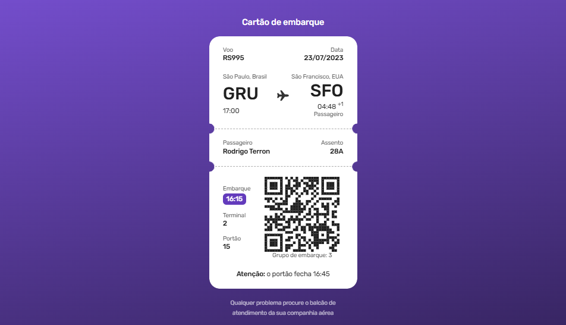

  <h1 align="center"> Desafio-6 </h1>

  

  Programa exclusivo e gratuito, promovido pela Rocketseat para ensino de tecnologias WEB.  
  <a href="https://lp.rocketseat.com.br/devlinks/inscricao?utm_source=github&utm_medium=descricao&utm_campaign=capture-devlinks&utm_term=organic&utm_content=descricao-github-mayk-brito">Estude esse projeto em formato de vídeo clicando aqui.</a>
  

  

    <a href="#-tecnologias">Tecnologias</a>&nbsp;&nbsp;&nbsp;|&nbsp;&nbsp;&nbsp;
    <a href="#-projeto">Projeto</a>&nbsp;&nbsp;&nbsp;|&nbsp;&nbsp;&nbsp;
    <a href="#memo-licença">Licença</a>
  

  

    
  

   

  

    
  

  ## 🚀 Tecnologias

  Esse projeto foi desenvolvido com as seguintes tecnologias:

  - HTML e CSS
  - Git e Github
  - Figma

  ## 💻 Projeto

  O Desafio-6 é um passaporte criado usando fundamentos do CSS

  - [Acesse o projeto finalizado, online](https://heitorbbtc.github.io/desafio-6/)

  ## :memo: Licença

  Esse projeto está sob a licença MIT.

  ---

  Feito com ♥ by heitorbbtc :wave: 
